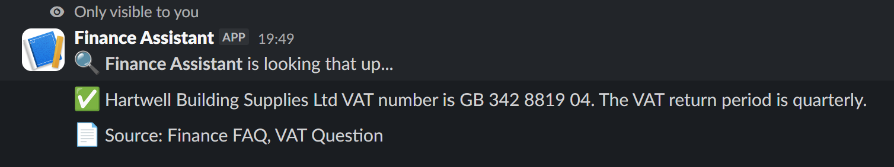
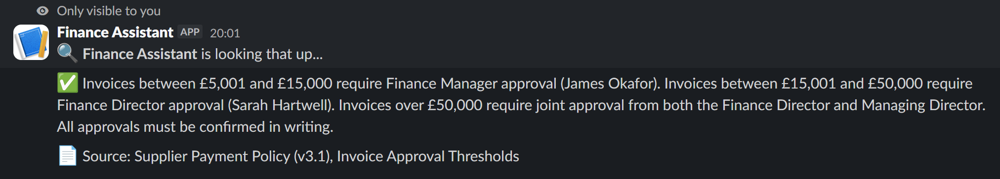

# Slack Finance RAG Bot

A Slack slash command that lets staff ask finance questions and get instant, sourced answers from a company knowledge base — built using n8n and Claude AI.

Type `/finance who approves invoices over £5k?` in Slack and get back a cited answer in seconds.

---

## What It Does

Staff type a finance question using the `/finance` slash command. The bot searches a knowledge base of finance documents and returns a concise answer with a source citation — directly in the Slack channel.

**Example:**

> `/finance what are our standard payment terms with suppliers?`
>
> ✅ Standard payment terms are 30 days from the date of invoice. Different terms must be agreed in writing and approved by the Finance Director.
> 📋 Source: Supplier Payment Policy (v3.1), Standard Payment Terms

## Demo Screenshots

**VAT lookup**



**Invoice approval policy lookup**



---

## Architecture

```
Slack /finance command
        │
        ▼
[n8n Webhook] ──► [Respond to Webhook] ── sends ":mag: looking that up..." immediately
        │
        ▼
[Set: Prepare Claude Request]
  extracts question, response_url from Slack payload
  loads full knowledge base as system prompt
        │
        ▼
[HTTP Request: Ask Claude]  ──► Anthropic API (claude-haiku-4-5)
        │                              │
        │ (on error)                   │
        ▼                              ▼
[Post Error to Slack]        [Set: Format Answer]
                                       │
                                       ▼
                             [HTTP Request: Post Answer to Slack]
                               POSTs to Slack response_url
```

**Why the two-step Slack response?** Slack requires a 200 HTTP response within 3 seconds or it shows a timeout error to the user. Claude API calls take longer than that. The solution: the webhook immediately acknowledges the request, then posts the real answer asynchronously to Slack's `response_url`.

---

## Stack

| Component | Tool |
|---|---|
| Workflow orchestration | n8n (self-hosted) |
| LLM | Claude Haiku 4.5 via Anthropic API |
| Slack integration | Slash command + response_url pattern |
| Knowledge base | Static markdown documents, loaded as system prompt |

---

## Knowledge Base

Four documents covering Hartwell Building Supplies Ltd (fictional company used for demo purposes):

| File | Contents |
|---|---|
| `finance-faq.md` | Common staff questions on invoices, payments, expenses |
| `supplier-payment-policy.md` | Approval thresholds, payment terms, fraud prevention |
| `month-end-checklist.md` | Close schedule, task list, sign-off deadlines |
| `chart-of-accounts.md` | Full nominal code list (4000–9520) |

All company data is fictional and used for demonstration purposes only.

---

## Demo Questions

Use questions that are covered by the fictional Hartwell knowledge base. These prompts are good for a live walkthrough:

```text
/finance who approves invoices over £5k?
/finance what are our standard payment terms with suppliers?
/finance when are payment runs processed?
/finance do I need a purchase order before buying something?
/finance what is the bank reconciliation deadline?
/finance when does the month-end pack need to be submitted?
/finance what is our VAT number?
/finance can I reclaim VAT on client entertainment?
```

Questions about revenue, profit, cash balances, or financial statements intentionally return a fallback response because those figures are not included in the demo knowledge base.

---

## Setup

### Prerequisites

- n8n (self-hosted or cloud)
- Anthropic API key
- A Slack app with a `/finance` slash command

### Steps

1. **Import the workflow** — in n8n, go to Workflows → Import → upload `workflow/slack-finance-rag.json`

2. **Add your Anthropic credential** — in n8n, go to Credentials → New → Anthropic → paste your API key. Name it `Anthropic`.

3. **Configure the Slack slash command** — in your Slack app settings, set the `/finance` Request URL to:
   ```
   https://your-domain-or-ngrok-url/webhook/finance
   ```

4. **Activate the workflow** — toggle the workflow active in n8n

5. **Test it** — type `/finance what are our payment terms?` in Slack

### Environment

Copy `.env.example` to `.env` and fill in your values. The `.env` file is gitignored and should never be committed.

For n8n 2.18.x and newer, the Slack HMAC verification Code node also needs Node's `crypto` module to be allowed in the task runner:

```env
NODE_FUNCTION_ALLOW_BUILTIN=crypto
SLACK_SIGNING_SECRET=your_slack_signing_secret_here
```

The workflow reads `SLACK_SIGNING_SECRET` from the n8n environment in a Set node, then passes it into the Code node as item data. This avoids reading `$env` directly inside the Code node, which can be blocked by n8n's task-runner sandbox.

---

## Security Notes

- This repository contains only fictional Hartwell Building Supplies Ltd data.
- No real Slack tokens, Anthropic keys, n8n credential IDs, MCP tokens, encryption keys, or live webhook URLs are committed.
- `.env`, local Claude/Codex context files, logs, and workflow backup exports are ignored by git.
- The exported workflow includes Slack request signing verification using HMAC-SHA256 and a five-minute replay window.
- Replace all placeholder values with your own local credentials after importing the workflow.

---

## Project Notes

- The knowledge base is embedded directly in the workflow as a system prompt. For larger document sets, replace the `Prepare Claude Request` node with a vector search step (e.g. Qdrant + embeddings).
- The workflow uses Claude Haiku for speed. Swap to Sonnet in the `Ask Claude` node for more complex reasoning tasks.
- No Slack Bot Token required — the `response_url` pattern is self-contained and authenticated by Slack's own request signing.
